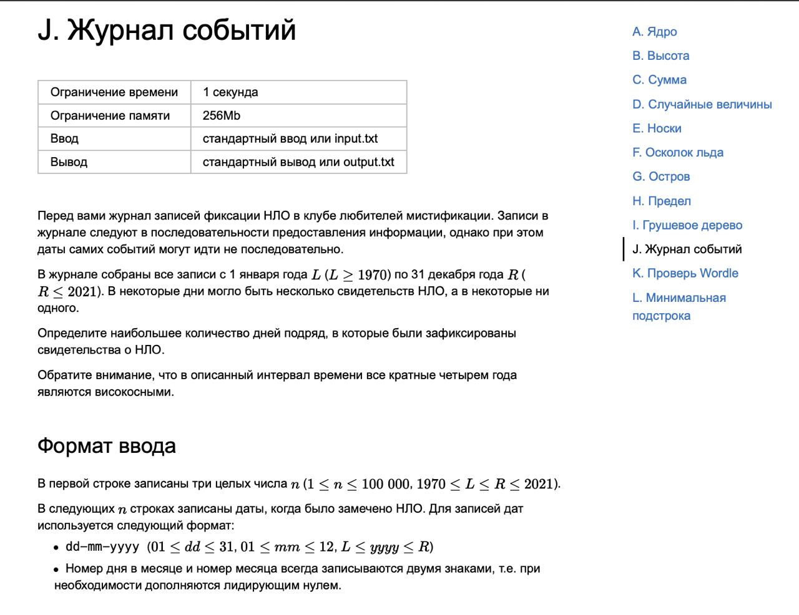

<h1>ШАД 2022</h1>

<h2>Задачи с экзаменов</h2>

<h3> Логика </h3>
Я решил представить даты как точки на прямой. Где ноль - начала записей в журнал событий (1 января L года).
Определить наибольшее количество дней подряд - значит найти максимальное расстояние между точками. 
<a href='https://github.com/hardworkerM/Algoritmic_tasks/blob/master/Stage_1/J.py'> Реализация</a> 
